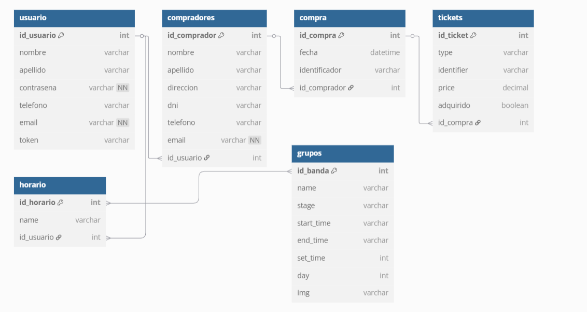
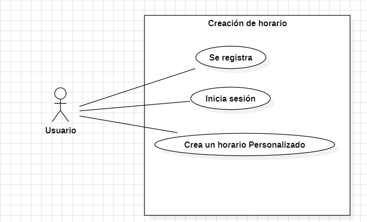
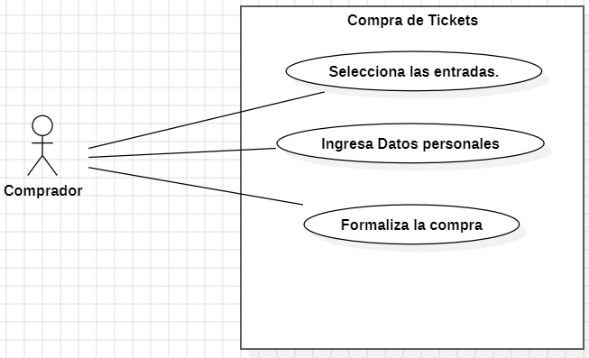
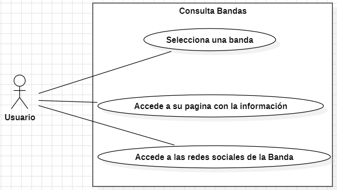
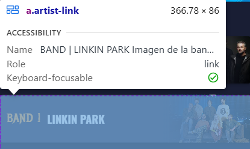
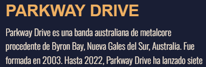
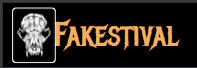
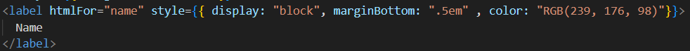
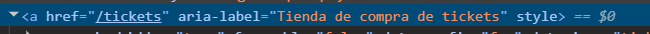
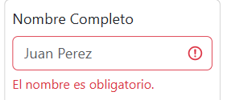

# Fakestival: Aplicación de Gestión de Festivales de Música

## Introducción

La aplicación de gestión de festivales de música **Fakestival** surge para abordar la necesidad de una plataforma fácil de usar, intuitiva y centrada en el usuario, que recoja todas las funcionalidades esenciales del consumidor habitual de este tipo de eventos.

En Fakestival un usuario puede organizar toda su estancia en el evento: desde la adquisición de tickets de acceso al recinto, la organización personalizada de los conciertos que desea ver, hasta una sección con información detallada sobre cada una de las bandas invitadas.

La idea surge de la experiencia directa de los desarrolladores en festivales y busca dar solución a carencias comunes en plataformas de gestión existentes.

---

## Modelo de Datos

### Introducción

Este apartado detalla el modelo de datos de Fakestival, desglosando:
- El Modelo Entidad-Relación
- El Modelo Relacional
- Script SQL asociado

Para un desglose en detalle de los atributos y sus relaciones, [vea la sección de Relaciones y Reglas de Negocio](#relaciones-y-reglas-de-negocio).

### Modelo E-R



#### Entidades

**Usuarios**
- id_usuario (PK, autoincremental)
- nombre
- apellido
- contrasena (NOT NULL)
- telefono
- email (NOT NULL, único)
- token

**Compradores**
- id_comprador (PK, autoincremental)
- nombre
- apellido
- direccion
- dni (único)
- telefono
- email (único, NOT NULL)
- id_usuario (FK, nullable)

**Compras**
- id_compra (PK, autoincremental)
- fecha (datetime)
- identificador (único)
- id_comprador (FK)

**Tickets**
- id_ticket (PK, autoincremental)
- type
- identifier (único)
- price (decimal)
- adquirido (boolean)
- id_compra (FK)

**Horarios**
- id_horario (PK, autoincremental)
- name
- id_usuario (FK)

**Grupos**
- id_banda (PK, autoincremental)
- name
- stage
- start_time
- end_time
- set_time (int)
- day (int)
- img

#### Relaciones y Reglas de Negocio

- Comprador - Usuario: 1:1 (FK opcional)
- Compra - Comprador: N:1
- Ticket - Compra: N:1
- Horario - Usuario: N:1
- Horario - Banda: N:M mediante tabla `horario_banda`

### Script SQL

CREATE TABLE usuario (
    id_usuario INT PRIMARY KEY AUTO_INCREMENT,
    nombre VARCHAR(255),
    apellido VARCHAR(255),
    contrasena VARCHAR(255) NOT NULL,
    telefono VARCHAR(255),
    email VARCHAR(255) NOT NULL UNIQUE,
    token VARCHAR(255)
);


CREATE TABLE compradores (
    id_comprador INT PRIMARY KEY AUTO_INCREMENT,
    nombre VARCHAR(255),
    apellido VARCHAR(255),
    direccion VARCHAR(255),
    dni VARCHAR(255) UNIQUE,
    telefono VARCHAR(255),
    email VARCHAR(255) NOT NULL UNIQUE,
    id_usuario INT,
    FOREIGN KEY (id_usuario) REFERENCES usuario(id_usuario) ON DELETE SET NULL
);


CREATE TABLE compra (
    id_compra INT PRIMARY KEY AUTO_INCREMENT,
    fecha DATETIME,
    identificador VARCHAR(255) UNIQUE,
    id_comprador INT,
    FOREIGN KEY (id_comprador) REFERENCES compradores(id_comprador)
);


CREATE TABLE tickets (
    id_ticket INT PRIMARY KEY AUTO_INCREMENT,
    type VARCHAR(255),
    identifier VARCHAR(255) UNIQUE,
    price DECIMAL(10,2),
    adquirido BOOLEAN,
    id_compra INT,
    FOREIGN KEY (id_compra) REFERENCES compra(id_compra)
);


CREATE TABLE horario (
    id_horario INT PRIMARY KEY AUTO_INCREMENT,
    name VARCHAR(255),
    id_usuario INT,
    FOREIGN KEY (id_usuario) REFERENCES usuario(id_usuario)
);


CREATE TABLE grupos (
    id_banda INT PRIMARY KEY AUTO_INCREMENT,
    name VARCHAR(255),
    stage VARCHAR(255),
    start_time VARCHAR(255),
    end_time VARCHAR(255),
    set_time INT,
    day INT,
    img VARCHAR(255)
);


CREATE TABLE horario_banda (
    id_horario INT,
    id_banda INT,
    PRIMARY KEY (id_horario, id_banda),
    FOREIGN KEY (id_horario) REFERENCES horario(id_horario),
    FOREIGN KEY (id_banda) REFERENCES grupos(id_banda)
);

### Modelo Relacional

Usuarios: ( _id_usuario_ , nombre , apellido , contrasena NOT NULL , telefono , email NOT NULL UNIQUE , token , PRIMARY KEY (_id_usuario) )

Compradores: ( _id_comprador_ , nombre , apellido , direccion , dni UNIQUE , telefono , email UNIQUE NOT NULL , _id_usuario_ * , PRIMARY KEY (_id_comprador) , FOREIGN KEY (_id_usuario_) REFERENCES usuario(_id_usuario) ON DELETE SET NULL )

Compras: ( _id_compra_ , fecha , identificador UNIQUE , _id_comprador_ * , PRIMARY KEY (_id_compra) , FOREIGN KEY (_id_comprador_) REFERENCES compradores(_id_comprador) )

Tickets: ( _id_ticket_ , type , identifier UNIQUE , price , adquirido , _id_compra_ * , PRIMARY KEY (_id_ticket) , FOREIGN KEY (_id_compra_) REFERENCES compra(_id_compra) )

Horarios: ( _id_horario_ , name , _id_usuario_ * , PRIMARY KEY (_id_horario) , FOREIGN KEY (_id_usuario_) REFERENCES usuario(_id_usuario) )

Grupos: ( _id_banda_ , name , stage , start_time , end_time , set_time , day , img , PRIMARY KEY (_id_banda) )

Horarios_Bandas: ( _id_horario_ * , _id_banda_ * , PRIMARY KEY (_id_horario_, _id_banda_) , FOREIGN KEY (_id_horario_) REFERENCES horario(_id_horario) , FOREIGN KEY (_id_banda_) REFERENCES grupos(_id_banda) )

---
```markdown
# Fakestival - README

Este archivo README proporciona información general sobre el proyecto Fakestival, incluyendo las pruebas unitarias del componente `<BuyingForm>`, manuales de instalación para desarrolladores y técnicos, un manual de usuario y la pila tecnológica utilizada.

## Pruebas Unitarias del Componente `<BuyingForm>`

Este bloque de pruebas se centra en la funcionalidad del componente `<BuyingForm>`.

**Descripción del Conjunto de Pruebas:** "BuyingForm Component" - Indica que las pruebas dentro de este bloque están dedicadas al componente `<BuyingForm>`.

**Importaciones:**
```javascript
import { render, screen, fireEvent } from '@testing-library/react';
import BuyingForm from '../path/to/BuyingForm'; // Asegúrate de actualizar la ruta correcta
```

**Variables de Configuración:**
```javascript
const mockHandleCloseModal = vi.fn();
const mockCounts = { standard: 1, vip: 2, premium: 0 };
```

```javascript
beforeEach(() => {
  vi.clearAllMocks();
});
```

### Prueba 1: muestra la información de los tickets seleccionados correctamente


**Acciones:**
```javascript
render(<BuyingForm counts={mockCounts} handleCloseModal={mockHandleCloseModal} />);
```

**Verificaciones:**
```javascript
expect(screen.getByText("Standard Pass x1")).toBeInTheDocument();
expect(screen.getByText("VIP Pass x2")).toBeInTheDocument();
expect(screen.queryByText("Premium Pass")).not.toBeInTheDocument();
expect(screen.getByText("339.97€")).toBeInTheDocument();
```

**Resumen:** Esta prueba verifica que el componente `<BuyingForm>` renderiza correctamente la información sobre los tickets seleccionados (cantidad y tipo) y el precio total, basándose en las props `counts` que se le pasan.

### Prueba 2: muestra mensajes de error si se envía un formulario vacío


**Acciones:**
```javascript
render(<BuyingForm counts={mockCounts} handleCloseModal={mockHandleCloseModal} />);
const submitButton = screen.getByText("Continuar con el pago");
fireEvent.click(submitButton);
```

**Verificaciones:**
```javascript
expect(screen.getByText("El nombre es obligatorio.")).toBeInTheDocument();
expect(screen.getByText("El correo electrónico es obligatorio.")).toBeInTheDocument();
expect(screen.getByText("Selecciona un método de pago.")).toBeInTheDocument();
```

**Resumen:** Esta prueba verifica que al intentar enviar el formulario sin completar los campos obligatorios (nombre, correo electrónico y método de pago), se muestran los correspondientes mensajes de error de validación.

### Prueba 3: Informa al usuario del formato de email esperado si se ha introducido uno incorrecto


**Acciones:**
```javascript
render(<BuyingForm counts={mockCounts} handleCloseModal={mockHandleCloseModal} />);
fireEvent.change(screen.getByPlaceholderText("juan.perez@email.com"), { target: { value: "pepito mail.com" } });
const submitButton = screen.getByText("Continuar con el pago");
fireEvent.click(submitButton);
```

**Verificaciones:**
```javascript
expect(screen.getByText("Por favor, introduce un correo válido. Ejemplo: persona@algo.com")).toBeInTheDocument();
```

**Resumen:** Esta prueba verifica que si el usuario introduce un formato de correo electrónico inválido y envía el formulario, se muestra un mensaje de error informándole sobre el formato esperado.

### Prueba 4: cierra el modal al completar el formulario correctamente


**Acciones:**
```javascript
render(<BuyingForm counts={mockCounts} handleCloseModal={mockHandleCloseModal} />);
fireEvent.change(screen.getByPlaceholderText("Juan Perez"), { target: { value: "Juan Perez" } });
fireEvent.change(screen.getByPlaceholderText("juan.perez@email.com"), { target: { value: "juan.perez@email.com" } });
fireEvent.change(screen.getByLabelText("Método de pago"), { target: { value: "creditCard" } });
const submitButton = screen.getByText("Continuar con el pago");
fireEvent.click(submitButton);
```

**Verificaciones:**
```javascript
expect(mockHandleCloseModal).toHaveBeenCalledTimes(1);
```

**Resumen:** Esta prueba verifica que cuando el formulario dentro del componente `<BuyingForm>` se completa con datos válidos y se envía, la función `handleCloseModal` proporcionada como prop se llama una vez, lo que se interpreta como el cierre exitoso del modal.

---
## Manual de usuario


Esta imagen muestra donde se puede iniciar sesión o registrarte en caso de no estarlo


en caso de estarlo se mostrará este modal para acceder al calendario o cerrar sesión


1. El apartado señalado nos permitirá elegir el día que queramos y ver las bandas que 
tocarán ese día.
2. Esto nos mostrará en qué día estamos situados en el calendario del evento.
3. Ya aquí podremos ver la información de la banda en el evento tanto el nombre de la banda, el lugar en el que toca dentro del festival y
también la hora a la que empieza y acaba su turno.


** (Implementado en Angular y ha sido evaluado anteriormente en el curso) **


1.  En esta selección de cantidad de entradas podremos comprar desde 1 hasta 5 entradas como máximo.
2.  Existen tres tipos de entradas diferentes para comprar una estándar, un pase vip y un pase premium.
3.  Y en el botón señalado ya pasaremos a proceder a la compra accediendo al carrito para finalizar la compra.


1.  Aquí se colocará el nombre del comprador.
2.  Aquí el correo electrónico del comprador.
3.  En este apartado se seleccionará el método con el que queremos hacer la compra.

---

## Manual de Instalación

**✅ Requisitos**
* Sistema operativo: Windows o Linux (Ubuntu de Linux recomendado)
* Node.js y npm instalados
* Base de datos (MongoDB o PostgreSQL)
* Git
* IDE Visual Studio code y InteliJ

Este manual explica cómo instalar y ejecutar el proyecto Fakestival en local, tanto el cliente como el servidor.

**📁 1. Clonar el repositorio**
```bash
git clone [https://github.com/usuario/fakestival.git](https://github.com/usuario/fakestival.git)
cd fakestival
```

**🌐 2. Instalar el Frontend**
Ve a la carpeta del cliente:
```bash
cd frontend
```
Instala las dependencias:
```bash
npm install
```
Ejecuta la app:
```bash
npm start
```
Por defecto se abre en `http://localhost:3000`.

**🔧 3. Instalar el Backend**
En otra terminal, ve a la carpeta del servidor:
```bash
cd backend
```
Instala las dependencias:
```bash
npm install
```
Ejecuta el servidor:
```bash
npm run dev
```
El servidor estará en `http://localhost:4000`.

**✅ 4. Notas**
Asegúrate de que el frontend se conecta a la URL correcta del backend (ej: `http://localhost:4000`) mediante una variable `.env` o archivo de configuración.

No olvides crear los archivos `.env` si se requieren claves o URLs.

---

## Pila Tecnológica

**Web/App**
* Typescript
* Javascript
* CSS
* HTML
* React
* Firebase

---

## Ayuda al Usuario Dentro de la App

Si se selecciona el icono de interrogante dentro de la aplicación, se abrirá un sistema de ayuda para el usuario que describe el funcionamiento del sistema con imágenes.


## Casos de Uso

### 1. Creación de un Horario Personalizado
1. Registro de usuario
2. Inicio de sesión
3. Selección de bandas y creación del horario



### 2. Compra de Tickets
1. Acceso a sección de tickets
2. Ingreso de datos del comprador
3. Confirmación de compra



### 3. Consulta de Bandas
1. Elección de banda del listado
2. Acceso a su página
3. Lectura de información y redes sociales



---

## Interfaces

### Accesibilidad

La aplicación cumple con las **WCAG (Web Content Accessibility Guidelines)**. Se han implementado los siguientes criterios:

1. **Texto alternativo en imágenes**
   - `alt` en cada imagen
   - Descripciones para lectores de pantalla
   

2. **Contraste adecuado**
   - Mínimo 4.5:1 entre texto y fondo
   

3. **Navegación con teclado**
   - Se puede usar sin ratón (tab, enter, esc)
   

4. **Etiquetas de formulario claras**
   - Uso de `<label>` correctamente asociado
   

5. **Roles y atributos ARIA**
   - Uso de `aria-label`, `aria-expanded`, etc.

6. **Enlaces descriptivos**
   - Enlaces con texto significativo (ej. "Comprar entradas")
   

7. **Tamaño y espaciado de texto**
   - Texto legible (16px+), botones amplios

8. **Manejo de errores accesible**
   - Mensajes claros y roles como `aria-invalid`

8. **Manejo de errores accesible** 
   - Mensajes de error claros y entendibles.
   

---
# Fakestival - Gestión de Tareas y Planificación del Proyecto

En Fakestival, la organización y el seguimiento del desarrollo son fundamentales. Nos coordinamos de manera continua a través de discusiones y reuniones, pero también utilizamos activamente GitHub y un sistema de planificación visual para asegurar un flujo de trabajo eficiente y transparente.

## Gestión de Tareas con GitHub y Sistema de Planificación

Como se puede observar en la captura de pantalla, empleamos un sistema de planificación visual integrado directamente en GitHub (o conectado a él). Este sistema nos permite:

---
# Fakestival - Diseño Inicial

Este documento contiene el enlace a los diseños iniciales (mockups y prototipos) del proyecto Fakestival.

## Diseño Inicial: Mockups y Prototipado

Puedes acceder a los diseños iniciales del proyecto a través del siguiente enlace de Figma:

[Figma Project - Music Festival](https://www.figma.com/design/AelGhOyxnH1tlEg3D499wQ/Figma-Project---Music-Festival?node-id=0-1&t=BipHCiUFlXk6aD1s-1)

---

# Fakestival - Tu Portal Integral para el Festival

**Nuestras Conclusiones:**

Fakestival.com es el centro digital para todo asistente al festival. Ofrecemos información detallada de las bandas con enlaces a sus redes, horarios oficiales para planificar tu día, una tienda de merchandising exclusiva y venta segura de tickets. Nuestra web está diseñada para una navegación intuitiva y acceso fácil a toda la información relevante.

**Nuestras Opiniones:**

Creemos que Fakestival.com proporciona una experiencia completa y valiosa, facilitando la exploración de las bandas, la organización de tu agenda y la adquisición de productos oficiales y entradas de forma segura.

**Nuestras Reflexiones:**

Priorizamos un diseño atractivo y una experiencia móvil fluida. Buscamos integrar más las redes sociales y mantener la información siempre actualizada. Nuestro objetivo es ser la herramienta esencial para que vivas al máximo la experiencia Fakestival.

**En resumen, en Fakestival.com encontrarás:**

* **Información Completa de las Bandas:** Trayectoria y enlaces a redes sociales.
* **Horarios Oficiales:** Planifica tu asistencia a los conciertos.
* **Tienda de Merchandising Exclusiva:** Lleva contigo un recuerdo del festival.
* **Venta Segura de Tickets:** Adquiere tus entradas de forma rápida y confiable.

---

## Créditos

Desarrollado por entusiastas de la música con experiencia en festivales. Esta aplicación busca mejorar la experiencia digital del asistente al evento.

Alejandro Abreu Hernández
Luis Hernández Rodríguez

Alumnos del IES El Rincon

---

## Licencia


